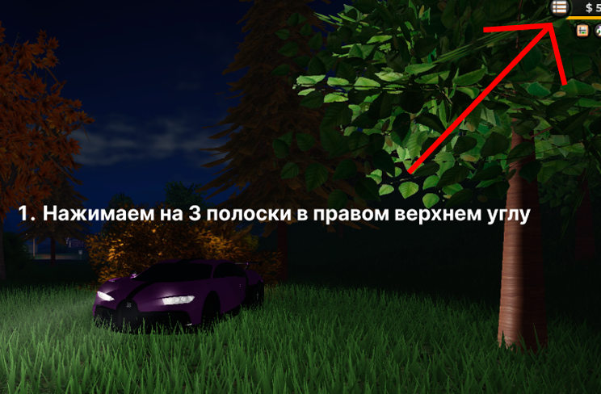

---
layout:
  width: default
  title:
    visible: false
  description:
    visible: false
  tableOfContents:
    visible: true
  outline:
    visible: true
  pagination:
    visible: true
  metadata:
    visible: true
  tags:
    visible: true
---

# 📖 Небольшой Гайд Для Новичков

<h2 align="center">👋 Добро Пожаловать в Moscow RolePlay!</h2>

<h2 align="center">Гайд для новичков Moscow Roleplay (ER:LC)</h2>

### Как зайти на сервер?

Чтобы играть на любом приватном сервере в Emergency Response: Liberty County, у тебя должно быть:

**1.** Не менее одного часа игрового времени.\
Игровые часы показываются тут: 

<figure><figcaption></figcaption></figure>

**2.** 500 XP в одной из игровых фракций (полиция, пожарные, шериф, дот).\
Не обязательно набирать по 500 XP в каждой — достаточно 500 XP в одной любой из них.

Дальнейшие шаги:

<figure><figcaption></figcaption></figure>

<figure><figcaption></figcaption></figure>

1. Нажимаем на 3 полоски в правом верхнем углу
2. Заходим во вкладку с серверами, выбираем "Join by Code"
3. Вводим в поле код **MoscowRus** 

***

### Советы для новичков

* Уважай участников и соблюдай правила — это делает сервер круче для всех!
* Всегда открывай тикеты в канале помощи, если возникла проблема.
* Следи за объявлениями — там вся движуха.
* Если ты новичок — загляни в 📘 ▎информация и 📄 ▎правила-и-документация.

🫶 Ты — часть Moscow RolePlay. Добро пожаловать в наш мир!\
🎭 Стань игроком, лидером или модератором. Здесь можно всё, главное — по правилам.

***

<h2 align="center">Ролевая Игра</h2>

**Ролевая игра** — это процесс взаимодействия созданных игроками персонажей, направленный на их развитие, которое достигается путем создания различных ролевых ситуаций, подпадающих под некоторые ограничения в виде лора и сеттинга, а также правил сервера.

<h3 align="center">Игровой Персонаж</h3>

Игровой персонаж — это созданный игроком образ, который имеет ряд своих уникальных характеристик: внешность, характер, повадки, поведение, историю, мотивы, цели и предрасположенности, а также недостатки и ограничения.

***

<h2 align="center">Криминальные Действия</h2>

Зелёным на карте отмечены места, где запрещена любая криминальная деятельность:

***

© 2026 Moscow RolePlay. Все права защищены.

