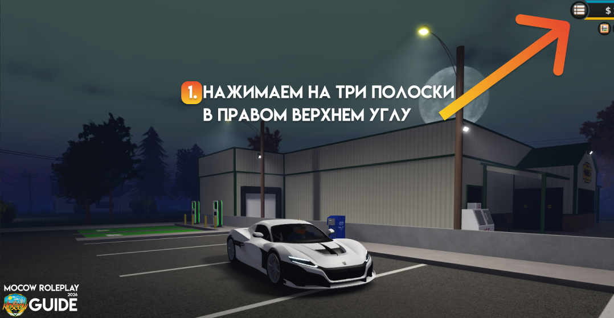

# Как начать игру

## <mark style="color:$warning;">Подготовка игры</mark>

***


Moscow RolePlay – это рускоязычный сервер в Emergency Response: Liberty County в Roblox. Здесь есть понятие ролевой игры и правила, и мы ожидаем их соблюдения от игроков.


<mark style="color:$info;">Проект MoscowRolePlay функционирует на базе платформы Roblox. Мы напоминаем, что каждый игрок обязан строго придерживаться как правил нашего сервера, так и общих правил сообщества Roblox.</mark>

## <mark style="color:$warning;">Знакомство поближе</mark>

***

* **Обязательно хотя бы кратенько изучи правила сервера.**

[https://wiki.erlcrussia.xyz/documentation-moscow-roleplay/](https://wiki.erlcrussia.xyz/documentation-moscow-roleplay/)

* **Как зайти на сервер?**

**Чтобы зайти на наш сервер вам потребуется:**

1. Зайти в игру и нажать на три полоски в правом верхнем углу

<figure><figcaption></figcaption></figure>

2. Перейдите во вкладку Servers и удостоверьтесь, что у вас есть один час отыгранного времени в основной игре, а также 500 XP в любой из игровых фракций (полиция, пожарные, шериф или ДОТ). Необязательно набирать по 500 XP в каждой — достаточно иметь 500 XP в одной из них. Посмотреть эту информацию можно во вкладке Players, нажав на своего персонажа.

<figure><figcaption></figcaption></figure>

<figure><figcaption></figcaption></figure>

3. Далее перейдите во вкладку JOIN BY CODE и в появившемся окне введите код `MoscowRus` — важно вводить его именно так! После этого просто нажмите JOIN для подключения к серверу.

<figure><figcaption></figcaption></figure>

## <mark style="color:$warning;">Что мне делать на первых этапах?</mark>

***

1. Для начала нужно корректно настроить своего игрового персонажа:

Ваш персонаж — основной объект ролевой игры, поэтому важно привести его в надлежащий вид. Тело должно быть строго классическим (квадратным, R15, без округлых деталей). На скине не должно быть предметов, которые человек не надел бы в повседневной жизни: крыльев, рогов, предметов с эффектами, питомцев на плечах, мечей, нестандартных анимаций или неестественного оттенка кожи. Внешний вид не должен выбиваться из рамок привычной реальности.

Если вы играете за какую-либо фракцию (полиция, пожарные, дорожные службы) или решили открыть свой бизнес, наличие красивой формы в соответствии с вашим рангом и специальностью только приветствуется!

<figure><figcaption></figcaption></figure> <figure><figcaption></figcaption></figure>

2. Из-за ограничений в работе Roblox в РФ всё наше общение теперь проходит в Discord. Вы можете коммуницировать с людьми на сервере экстренных служб [https://discord.gg/Ds9x3GTCWc](https://discord.gg/Ds9x3GTCWc) или на ивентах на основном сервере [https://discord.gg/moscowrus](https://discord.gg/moscowrus). Присоединяйтесь!
3. Есть вопросы? Вы можете задать их нашей команде, создав обращение в канале “тикеты” на нашем основном дискорд сервере.

<figure><figcaption></figcaption></figure>

***

© 2026 Moscow RolePlay. Все права защищены.

