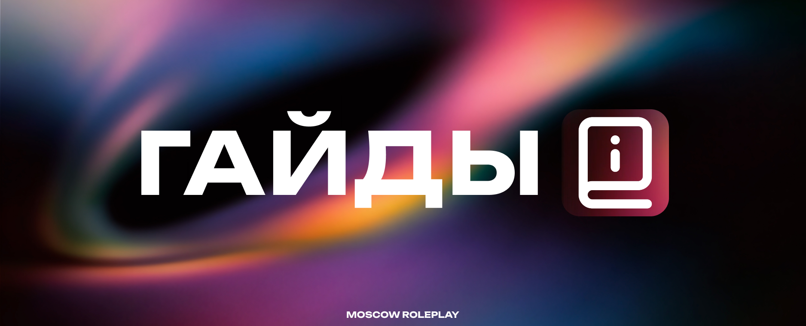

# 📗 Правила Публикации

<figure><figcaption></figcaption></figure>

**Гайд** — это пошаговая инструкция, план действий или руководство. Наши пользователи могут составлять их не только по игровым механикам, работе веб-ресурсов или вопросам, связанным с нашей командой, но и по любым другим темам.

Чтобы гайд был максимально полезным и получил одобрение, он должен соответствовать определенным требованиям:

* Строго по факту Гайд призван научить пользователя чему-то новому. В нем не место обсуждению посторонних тем, философским рассуждениям и лишней информации. Пишите четко и по существу.
* Оригинальность Текст должен быть полностью авторским. Если вы используете сторонние источники, обязательно указывайте ссылки на них.
* Наличие иллюстраций Весь процесс должен сопровождаться наглядными изображениями. При необходимости используйте видео или GIF-анимации для лучшего понимания материала.

Книга рекордов — это официальный реестр выдающихся достижений наших игроков. Здесь фиксируются результаты, которые выходят за рамки обычного геймплея и демонстрируют исключительное мастерство, упорство или креативность.

Чтобы ваша заявка была рассмотрена и внесена в список рекордов, она должна соответствовать следующим критериям:

* Доказательность и точность Рекорд — это факт, подтвержденный цифрами. В заявке не должно быть лишних описаний или художественных отступлений.
* Чистота исполнения Достижение должно быть получено честным путем. Использование багов или помощь администрации (если это не предусмотрено условиями рекорда) аннулирует заявку. При использовании заимствованных идей или методик обязательно указывайте первоисточник.
* Визуальное подтверждение Любой рекорд должен быть зафиксирован. Принимаются качественные скриншоты (без обрезок и замазанных элементов), видеозаписи или ссылки на логи (если применимо). Весь процесс установления рекорда должен быть прозрачным и понятным.

Оффтоп — это раздел для общения на свободные темы, которые не вписываются в основные категории форума. Здесь наши пользователи могут отвлечься от игровых механик, работы веб-ресурсов и официальных вопросов, чтобы просто пообщаться.

Чтобы раздел оставался интересным и чистым от мусора, соблюдайте следующие правила:

* Никаких рамок в темах Здесь можно обсуждать всё: от новинок кино и музыки до личных историй и хобби. Пишите о том, что вам интересно, делитесь мыслями и находите единомышленников.
* Уважение к сообществу Свобода общения не отменяет вежливости. Оскорбления, токсичное поведение и провокации запрещены. Оффтоп создан для отдыха, а не для выяснения отношений.
* Авторский контент и находки Если вы создаете что-то свое или нашли крутой контент в сети — смело делитесь. При использовании сторонних ресурсов желательно указывать автора или источник.
* Смысловая нагрузка Несмотря на то что это раздел «для всего», старайтесь избегать бессмысленного флуда. Сообщения, состоящие из случайных символов или не несущие никакого посыла, могут быть удалены, чтобы не забивать ленту.

 

***

© 2026 ER:LC Россия. Все права защищены.

